([中文](./zh.md) / [English](./en.md))

# PointerSearch-X 的教程

指针链扫描有什么用呢？

> 指针搜索概念：
> ASLR导致程序内存地址在启动程序时始终不同。所谓的“静态”地址是相对于程序代码（BinaryFile）的地址。有了静态地址，一旦找到它，你就可以稳定计算出这个地址，因为加载程序（BinaryFile）的地址很容易找到。不幸的是，并非所有感兴趣的内存都是“静态的”，因为这些要么需要代码黑客（通常称为ASM HACK），要么需要指针链（找到此链的过程通常被称为指针搜索PointerSearcher）。
> 指针搜索通常被用于自动化寻找较为复杂的指针链，对于很简单的指针链，只需要调试器就可以找到了。当然，指针搜索经常也适用于那些无法使用调试器的场景。

想象一下，一个游戏的难度太高了，你想要作弊，数据地址是动态的，每次开始游戏前你都需要花费几分钟时间来执行内存扫描找到数据的地址；

如果你需要的数据很隐蔽，例如游戏中的角色坐标，你可能需要更长时间才能找到，在这之前你需要请求敌人“先不要攻击我”。

而使用指针链你可以在 0.1秒 内找到数据的地址，你甚至可以分享给其它人使用（只要游戏版本相同）。

在这之前，需要先知道目标程序是以64位模式还是32位模式运行，PointerSearch-X 暂时只支持扫描64位原生应用程序。

首先需要知道目标地址和进程pid，我推荐使用 [PINCE](https://github.com/korcankaraokcu/PINCE)。

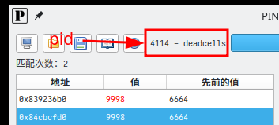

然后运行 `sudo ./dumper disk --pid 4114` 命令转储进程内存。

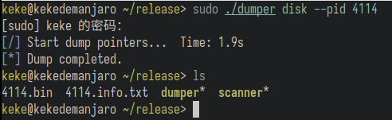

默认情况下它会创建两个文件 `*.bin` 和 `*.info.txt`。

接下来用文本编辑器打开 `*.info.txt`, 这里面记录了一些可以作为基址的模块，它将引导后续的指针链扫描行为。

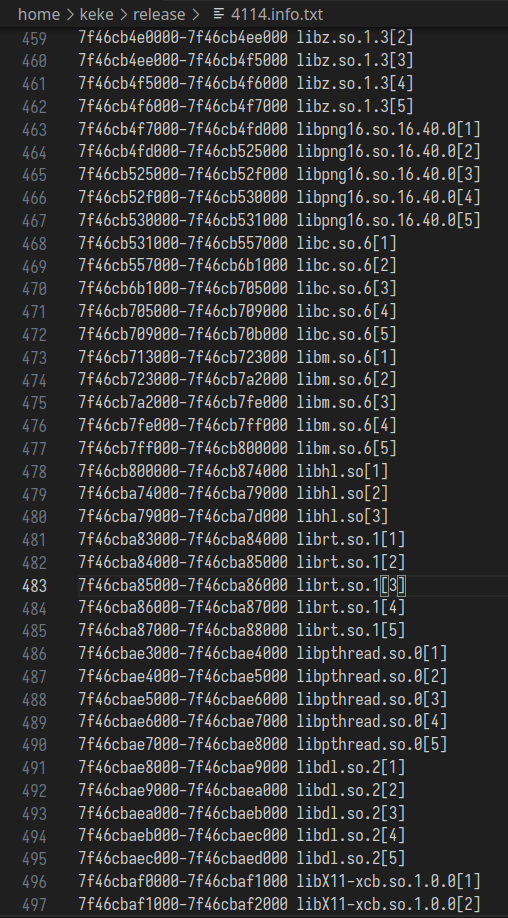

我们可以去除不需要的模块，例如 `libc.so.6` `libX11-xcb.so` 之类的，它是系统库，游戏数据绝不可能在里面，所以我们删除这些行。排除无用的模块可以加快扫描速度。

*文件中不要留有空白行

最终我只保留了这些

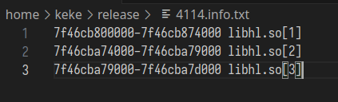

接下来运行扫描程序 

`./scanner scan --bin 4114.bin --info 4114.info.txt -l 0x84cbcfd0 -d 4 -r 0:4000`

`--bin` 指定转储的 `*.bin` 文件。

`--info` 指定我们修改过的 `*.info.txt` 文件。

`-l/--list` 可以指定多个目标地址，用 `-` 分隔。

`-d/--depth` 表示指针链的最大深度，最大支持 `2^64`。

`-r/--range` 表示偏移范围 它最大可以支持 `-2^64:+2^64`。

注意 `-d/--depth` 和 `-r/--range` 会极大影响扫描速度以及产生的结果。

扫描成本为 O（NN*D）（D：最大深度，N：偏移数）。一般情况下设置的数字越大，扫描越慢，结果越多。

扫描完成后它会产生一个 `*.scandata` 文件。

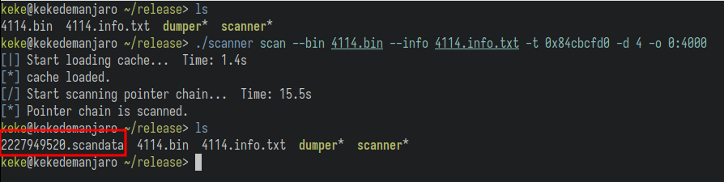

这里面会有很多指针链，但它们并不能保证全都是有效的。

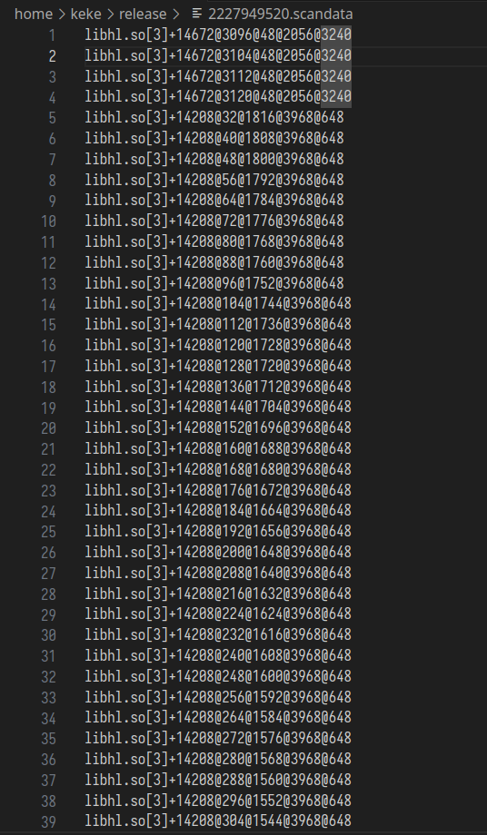

我们可以重新启动目标进程，然后重新 进行 找到目标地址->转储->扫描 这个步骤。

现在我们有这些文件。

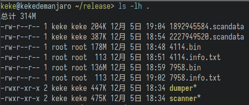

执行 `scanner diff --f1 1892945584.scandata --f2 2227949520.scandata --out coin.txt`

它会把两次扫描中稳定存在的指针链储存到 `coin.txt` 文件中。


我们随便找一个验证能不能用。

执行命令 `sudo ./dumper test --pid 9325 --chain "libhl.so[3]+14208@1176@2280@48@648"`

成功获得了硬币的地址 `0x70d7e298`

后续我又重启了目标进程两次，可以看到，可以准确获取到动态变化的硬币地址。

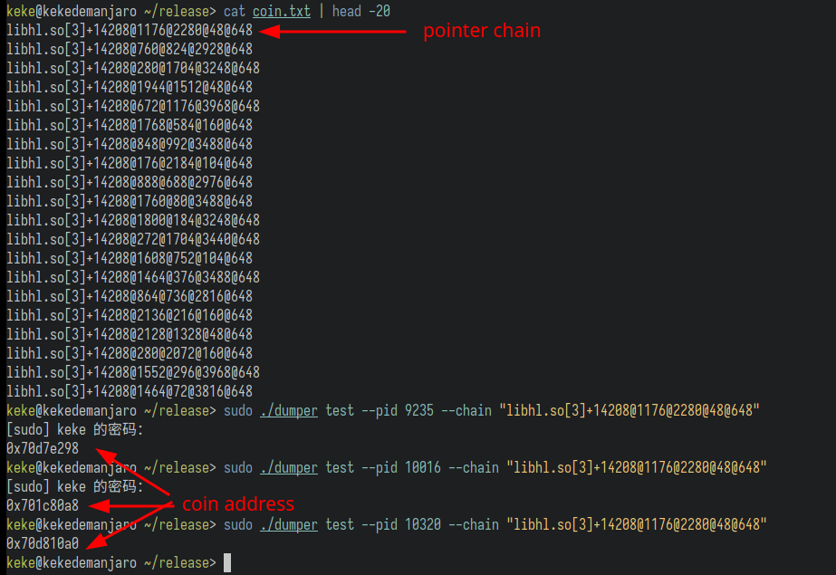

然后我们可以复制这个地址到 [PINCE](https://github.com/korcankaraokcu/PINCE) 中修改它。

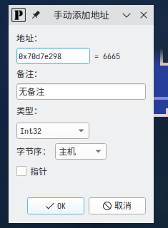


# TL;DR

写这个教程的时候我忘记了游戏是哪个版本。

如果你想要试一试 可以尝试 `Linux x86_64 死亡细胞 v34 [2023-06-20 - ffcb38d13 - 15 - Steam]`

设置 `depth/d` 6 `range/r` 0:900

> 游戏中的金币数据 验证指针链 `libhl.so[3]+14208@488@888@192@232@136@72`

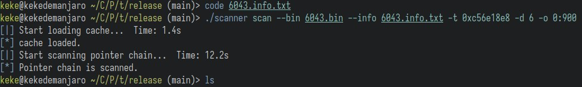

其它游戏: `安卓 arm64-v8a 九游版元气骑士 5.4.7.9`

设置 `depth/d` 4 `range/r` 0:3000

> 游戏中的金币数据 验证指针链 `libil2cpp.so[3]+7806384@184@576@32`

## FAQ

`*.scandata` 转换为 PINCE `*.pct` 作弊表。

```shell
./conv pince --scandata file.scandata
```

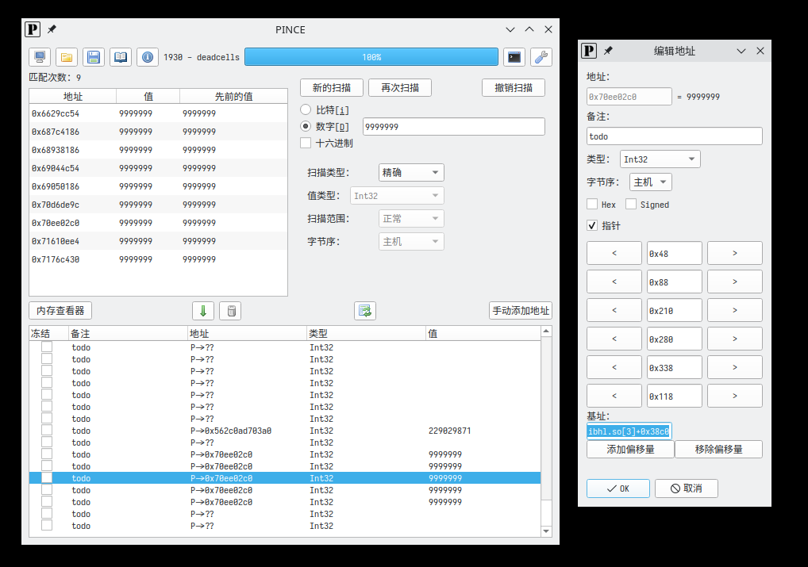